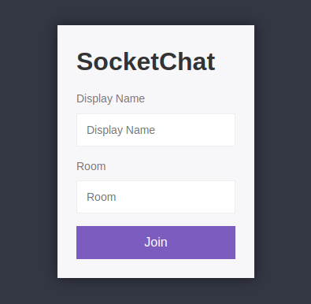

# SocketChat
## A real-time chat application using Socket.io

**[Socket.io](https://socket.io) enables Bidirectional and low-latency communication for every platform**

### Usage
Set an environment variable `PORT` with a value of your choice. By default, the application runs on port 3000.
```shell
npm install
```
```shell
npm run start
```
Open a browser and head over to the url of the application, e.g. `http://localhost:3000`. Enter a username and room, click `Join`.  

### Demo:
[https://socket-chat-5wmet.kinsta.app/](https://socket-chat-5wmet.kinsta.app/)

